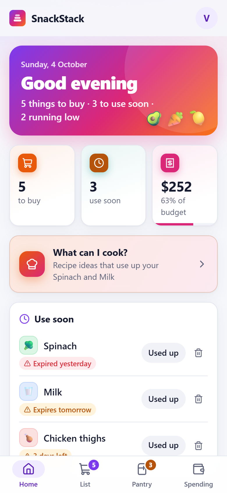
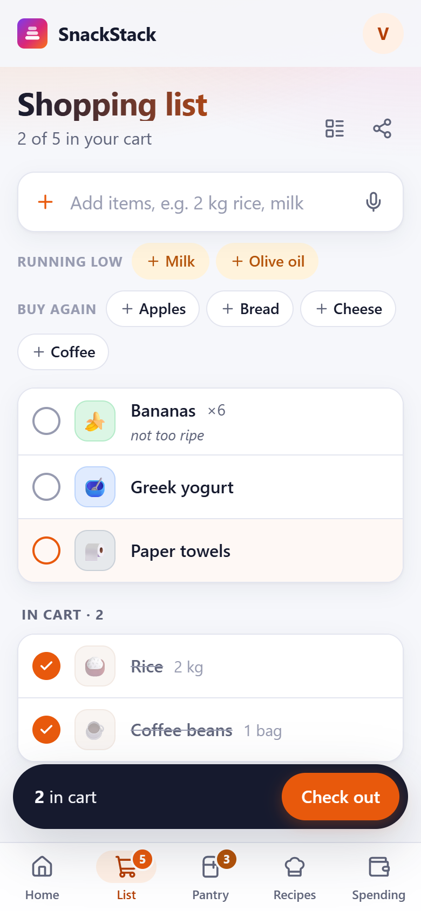
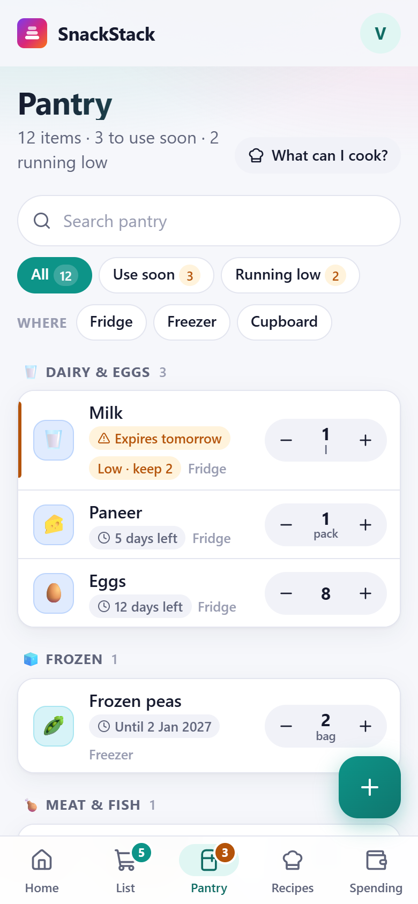
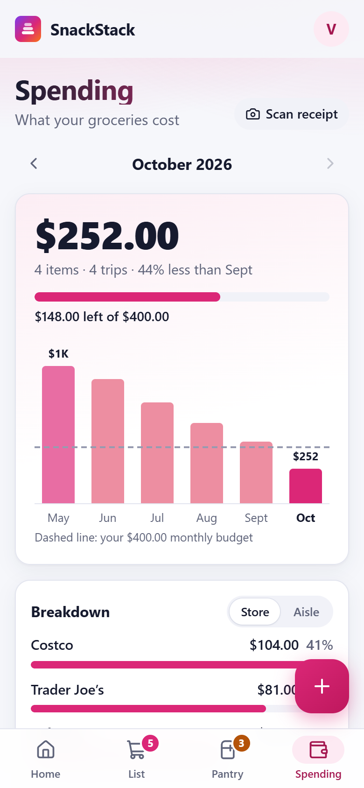
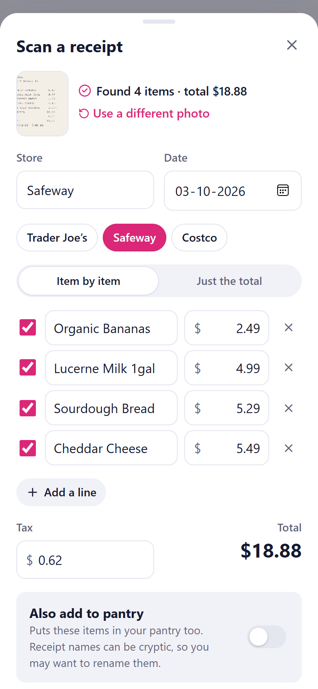
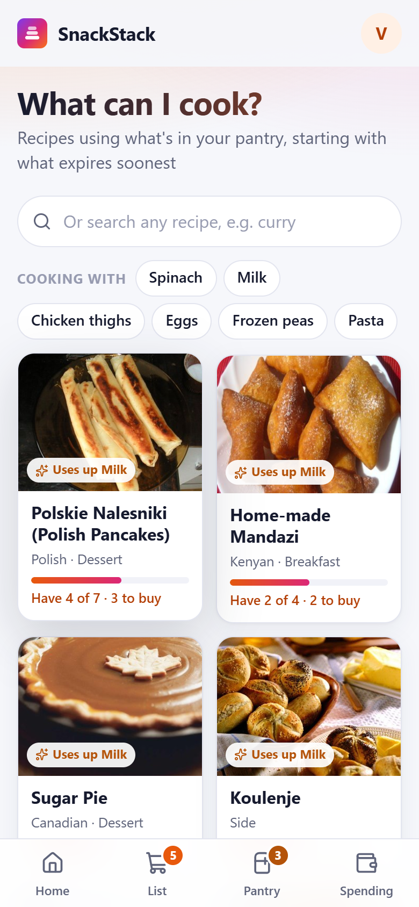
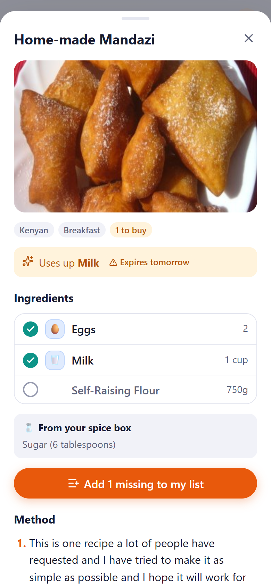
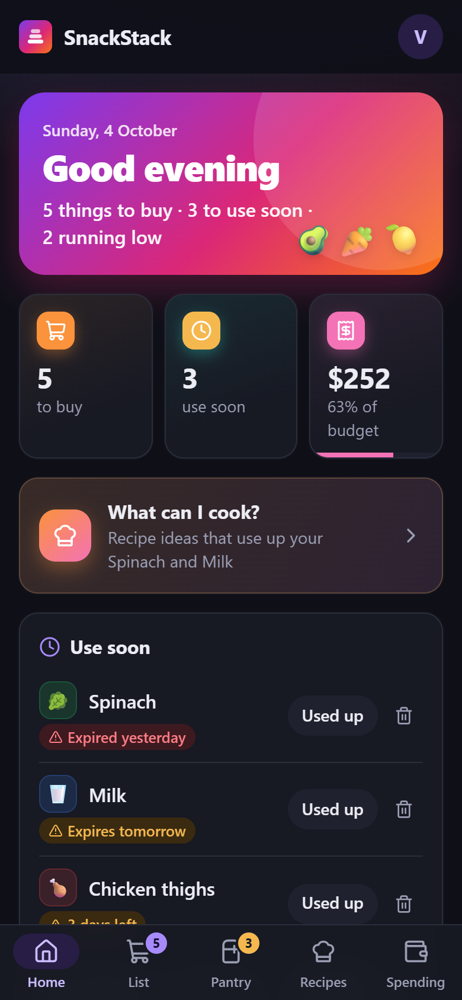
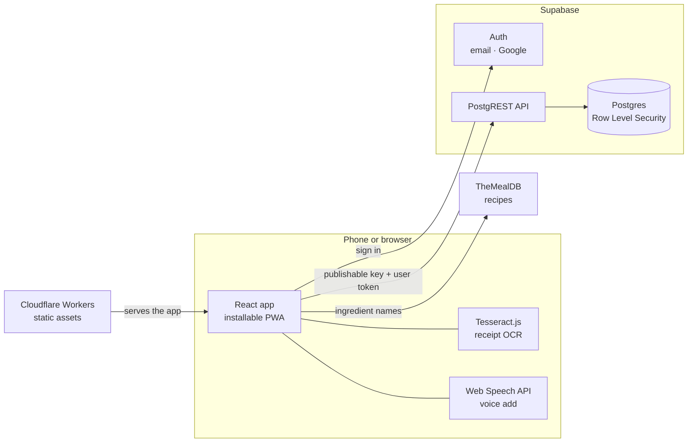

# SnackStack


A grocery tracker that works like a native phone app. SnackStack keeps your **shopping list,
pantry and grocery spending in one place**: check items into a cart while you shop, check out
once to log prices and stock the pantry, get warned before food expires or runs low, and see
where your money goes each month. Snap a photo of a receipt and the items, tax and total are
read **on your phone**. Ask what you can cook, and it suggests recipes that use up what's about
to expire.

It's a single page React app talking directly to Supabase, with Row Level Security doing the
access control, so there is no backend server to run. Hosting, database and auth all fit in
free tiers, and it runs at zero cost for personal use.

**Live:** [snackstack.vidit-pawar25.workers.dev](https://snackstack.vidit-pawar25.workers.dev). Create an account; your data is private to you.

## Screenshots

| Home | Shopping list | Pantry | Spending |
|---|---|---|---|
|  |  |  |  |
| A daily summary: what to buy, what to use soon, what's running low, and budget progress | Two items in the cart, suggestions for items running low and bought before | Grouped by aisle, with expiry, low-stock and storage location at a glance | A monthly budget with a dashed limit line, a 6-month trend, and a breakdown by store |

| Receipt scanning | What can I cook? | Recipe | Dark mode |
|---|---|---|---|
|  |  |  |  |
| A photo of a receipt read on the device, with the discount applied and the total matching | Recipes ranked by how much you already have, with expiring food first | What you have, what's missing (one tap adds it to your list), and the method | Every screen has a designed dark theme, not an inverted one |

Screenshots use sample data. Recipe photos are from [TheMealDB](https://www.themealdb.com).

## Features

**Shopping**
- Quick add that understands quantities and units: `2 kg rice`, `milk x2`, `1.5 l of milk`
- Add several at once (`milk, eggs, bread`), paste a whole list, or say it out loud
- Suggestions for what's running low and what you buy often
- Items sorted into aisles automatically, with an optional group-by-aisle view
- Notes on items, and sharing the list as text
- A cart for the store trip, then **one checkout** that logs prices, sets expiry dates and moves everything into the pantry, merging with what's already there

**Pantry**
- Expiry tracking with "use soon" warnings, and quick presets (3 days, 1 week, 1 month)
- Low-stock levels ("keep at least 2") that prompt you to restock
- Fridge, freezer and cupboard locations; search; filters for use soon and running low
- "Tossed it" logs food waste with its estimated cost
- Price history for every item: last, average and lowest price, and the cheapest store

**Spending**
- **Receipt scanning**: a photo becomes a reviewed list of purchases, read entirely on the device
- Monthly totals, a 6-month chart, comparison with last month, and a month-end projection
- A monthly budget with a progress bar and a limit line on the chart
- Breakdown by store or by aisle, top items, and a food waste summary

**Cooking**
- **What can I cook?**: recipes ranked by how much of each you already have, with expiring food first
- A built-in collection of 45 everyday Indian recipes (dals, sabzis, curries, rice dishes, breakfasts, sweets), plus All, Indian and Vegetarian filters
- Hindi ingredient names understood: aloo, gobi, palak, matar, dahi, besan, atta, rajma, chana and more
- A full recipe view with an ingredient checklist and **add the missing ones to my list**
- Search any recipe and see how much of it you can already make

**Everywhere**
- Changes appear instantly, with undo on deletes and checkouts
- Email and password or Google sign-in, with password reset
- Your currency of choice (USD by default), CSV export, keyboard shortcuts, light, dark and auto themes
- Installable to your home screen, with a phone-first layout and a desktop layout

## Architecture



There is no application server. The browser talks to Supabase's REST API directly, with the
user's session token. The publishable key is public by design: what protects the data is a
Row Level Security policy on every table that only lets a signed-in user read and write rows
where `user_id` is their own.

All of a user's data loads once into a client-side store ([src/store.tsx](src/store.tsx)), and
every change works like this:

1. The change is applied to local state immediately, so the UI never waits on the network.
2. The matching insert, update or delete is sent to Supabase in the background.
3. If it fails, an error toast appears and the store reloads from the server, so the screen never shows data that wasn't saved.
4. Multi-step actions like checkout (create purchases, merge pantry stock, clear the list) undo as one action.
5. When the app comes back into view, it reloads, picking up changes made on another device.

## The shopping trip

The core loop, and where most of the logic lives:

| Step | What happens |
|---|---|
| Add `2 kg rice` | Parsed into name, quantity and unit. Already on the list? The quantity goes up instead of adding a duplicate |
| Tap the circle at the store | The item moves to **In cart**. The cart is kept per device, since you shop with one phone |
| Check out | One form for the store, the date, each item's price (with last time's price as a hint) and expiry |
| Finish | Purchases are logged, items join the pantry or are added to what's there, and the list is cleared, all as one undoable action |
| Restocking something you'd run out of | Its expiry starts fresh. Restocking something still in stock keeps the **soonest** expiry, so the warning stays honest |

## Receipt scanning

A receipt photo becomes purchases without leaving the device:

1. **Prepare.** The photo is resized, converted to grayscale and contrast-stretched (ignoring the darkest and lightest 2% so a shadow or glare doesn't decide the range).
2. **Read.** [Tesseract.js](https://tesseract.projectnaptha.com) runs OCR in a web worker. The engine downloads once on first use, then the browser caches it.
3. **Parse.** [src/lib/receiptParse.ts](src/lib/receiptParse.ts) turns the text into a store, a date, line items, tax and a total.
4. **Review.** You confirm or fix everything before it's saved. A warning appears if the items and tax don't add up to the receipt's total.

| Receipt line | How it's read |
|---|---|
| `GV MILK 2%  007874235186  3.48 N` | Item "Gv Milk 2%", $3.48. The product code and tax flag are dropped |
| `CLUB CARD SAVINGS     1.00-` | A discount, subtracted from the item above it |
| `1.52 lb @ 3.49 /lb   5.30` after `CHICKEN THIGHS` | A weighed item: the name comes from the previous line |
| `OLIVE OIL EV 500ML    8,99` | A comma decimal, read as $8.99 |
| `TOTAL SAVINGS 1.00`, `SUBTOTAL`, `VISA`, `CHANGE DUE` | Summary and payment lines, never items |
| `10/03/26`, `2026-10-03`, `Oct 3, 2026` | The date, US order first, and only if it's in the last two years |

## What can I cook?

Recipes come from two sources, ranked together:

- **SnackStack's own Indian collection** ([src/lib/indianRecipes.ts](src/lib/indianRecipes.ts)): 45 everyday dishes, from dal tadka and rajma to poha, sambar and biryani. It's bundled with the app, so it's instant and works offline. TheMealDB has only about 15 Indian recipes, so this fills the gap.
- **[TheMealDB](https://www.themealdb.com)**: about 600 recipes from around the world.

TheMealDB's free API can search only one ingredient at a time, so its suggestions are built in two steps:

1. **Search.** Up to 6 pantry items, expiring first, are mapped to the database's ingredient names (for example "GV Milk 2%" becomes Milk) and searched.
2. **Rank.** Recipes that come up for several of your ingredients, or for expiring ones, become candidates. A per-day shuffle breaks ties, so results vary instead of sorting alphabetically. The top 30 are scored on the share of ingredients you have, a bonus for using up expiring food, and a small penalty for each missing item.

Matching an ingredient is directional ([src/lib/recipes.ts](src/lib/recipes.ts)):

| Your pantry | Recipe needs | Counts as having it? |
|---|---|---|
| Chicken thighs | chicken | Yes: the recipe is more general |
| Garlic | minced garlic | Yes: only descriptive words were added |
| Pasta | spaghetti | Yes: synonyms (also cilantro and coriander, eggplant and aubergine, and others) |
| Milk | coconut milk | **No**: a different ingredient |
| Chicken thighs | chicken breasts | **No** |

Spices and basics (salt, oil, ghee, haldi, jeera, garam masala, whole spices and so on) are listed separately as "from your spice box" and don't count as missing. Otherwise every Indian recipe would look like it needs ten things you don't have. Hindi and English names are treated as the same ingredient (aloo and potato, dahi and yogurt, atta and whole wheat flour), and so are spelling variants like "green chillies" and "green chili".

## Privacy

| Data | Where it goes |
|---|---|
| Lists, pantry, purchases, settings | Your Supabase project, readable only by your account |
| Receipt photos | Nowhere. Read on the device and never uploaded or stored |
| Pantry item names | Sent to TheMealDB to search for recipes |
| Voice input | Handled by the browser's speech service (in Chrome, Google's servers) |
| Cart contents, theme | Stored on the device only |

## Design notes

Problems found while building and testing, and how they're handled:

| Problem | How SnackStack handles it |
|---|---|
| The browser key is public, so anyone could call the API with it | Row Level Security on every table, and the `anon` role has no table access at all. Only a signed-in user reaches their own rows |
| Supabase returns at most 1000 rows per request; a long purchase history would silently cut off | Every table is read in pages until a short page comes back |
| A background reload could overwrite a change that was still saving | Saves in flight are counted, and a reload that finishes during one is discarded |
| `2026-10-04` parsed as a UTC date shows as October 3 west of Greenwich | Dates are stored as plain `YYYY-MM-DD` and always built and compared as local dates |
| "Total savings 1.00" on a receipt was read as a discount and taken off an item | Total lines are recognized first; savings and item-count totals are ignored |
| "Milk" in the pantry matched "coconut milk" in recipes | Matching is directional, and extra words must be descriptors like "minced" or "fresh" |
| Recipe search returned hundreds of results sorted A to Z, so "Apam balik" topped every list | A wider candidate pool, ranked by fit, with a per-day shuffle for ties |
| TheMealDB has about 15 Indian recipes, so an Indian kitchen got poor suggestions | A bundled collection of 45 Indian recipes, Hindi ingredient synonyms, and spices treated as staples |
| Newer Chrome returns a value from `window.scrollTo`, which React treated as an effect cleanup and crashed on | Effects never return expression results |
| A blurred, translucent header made the fixed bottom tab bar position itself inside the header on phones | No `backdrop-filter` on the header at phone widths |
| Browsers kept serving an old `index.html` after a deploy | [public/_headers](public/_headers) sets `no-cache` on the page, and caches hashed assets forever |
| The OCR engine is large and most visits never scan | It's loaded with a dynamic `import()` only when you scan, in its own chunk |

## Tech stack

- **Frontend:** React 19, TypeScript (strict), Vite 8, lucide-react icons, hand-written CSS with design tokens
- **Backend:** Supabase (Postgres, PostgREST, Auth) with Row Level Security
- **On device:** Tesseract.js for OCR, Web Speech API for voice, Web Share API
- **External data:** TheMealDB (free recipe API)
- **Hosting:** Cloudflare Workers static assets, deployed by Workers Builds on push to `main`

## Project structure

```text
snackstack/
├── src/
│   ├── screens/
│   │   ├── HomeScreen.tsx        # daily summary, use soon, running low
│   │   ├── ShoppingScreen.tsx    # quick add, cart, checkout
│   │   ├── PantryScreen.tsx      # pantry list and item editor
│   │   ├── SpendingScreen.tsx    # totals, chart, budget, breakdowns, waste
│   │   ├── ReceiptScan.tsx       # photo -> OCR -> review -> save
│   │   ├── CookScreen.tsx        # recipe suggestions, search, recipe view
│   │   └── AuthScreen.tsx        # sign in, sign up, Google, password reset
│   ├── lib/
│   │   ├── items.ts              # quick add parser, bulk split, low stock, price stats
│   │   ├── categories.ts         # aisle guessing, storage locations, aisle emoji
│   │   ├── receipt.ts            # image preparation and OCR
│   │   ├── receiptParse.ts       # receipt text -> store, date, items, tax, total
│   │   ├── recipes.ts            # TheMealDB client, ingredient matching, ranking
│   │   ├── indianRecipes.ts      # 45 built-in Indian recipes
│   │   ├── settings.tsx          # currency and budget, stored in the user profile
│   │   ├── format.ts             # local dates, money, months
│   │   ├── device.ts             # voice, sharing, CSV export, online status
│   │   └── cart.ts, route.ts, theme.ts
│   ├── ui/                       # Sheet, Toast, Stepper, PriceHistory, shared bits
│   ├── store.tsx                 # all data, optimistic updates, undo
│   ├── index.css                 # design tokens, per-tab colors, light and dark themes
│   └── App.tsx                   # auth gate, shell, navigation, settings
├── supabase/
│   ├── schema.sql                # tables, indexes, RLS policies
│   └── migrations/               # schema changes, run in order
├── public/                       # icon, web app manifest, Cloudflare cache headers
├── docs/screenshots/
├── wrangler.jsonc                # Cloudflare Workers config
└── vite.config.ts
```

## Data model

| Table | Holds | Notable columns |
|---|---|---|
| `shopping_items` | The shopping list | `quantity`, `unit`, `note`, `category` |
| `pantry_items` | What's at home | `expires_on`, `min_quantity`, `location`, `category` |
| `purchases` | Every price paid | `price`, `store`, `purchased_on`, `category` |
| `waste_log` | Food thrown away | `quantity`, `cost` (estimated from the last price paid), `logged_on` |

Every table has `user_id` defaulting to `auth.uid()` and one policy: a signed-in user can do
anything with rows where `user_id` is their own. Currency and budget are kept in the Supabase
user's metadata, so they follow the account across devices.

## Prerequisites

- [Node.js](https://nodejs.org) 20.19 or newer
- A free [Supabase](https://supabase.com) project
- A free [Cloudflare](https://cloudflare.com) account, for hosting

No paid services or API keys are needed.

## Configuration

| Variable | Description |
|---|---|
| `VITE_SUPABASE_URL` | Your project URL, e.g. `https://abcd1234.supabase.co` (without `/rest/v1/`) |
| `VITE_SUPABASE_KEY` | The **publishable** (or `anon`) key. Never the secret or `service_role` key, which bypasses every security rule |

Both are build-time variables: put them in `.env` locally (see [.env.example](.env.example)) and in the Cloudflare build variables for deploys.

## Getting started

### 1. Database

1. Create a Supabase project.
2. In **SQL Editor**, run [supabase/schema.sql](supabase/schema.sql), then each file in [supabase/migrations/](supabase/migrations/) in order.
3. In **Project Settings → API**, copy the project URL and the publishable key.

### 2. Run locally

```bash
git clone https://github.com/viditpawar/snackstack
cd snackstack
npm install
cp .env.example .env    # paste in your URL and key
npm run dev             # http://localhost:5173
```

New accounts get a confirmation email. To skip that while testing, turn off **Confirm email** under **Authentication → Sign In / Providers → Email**.

### 3. Deploy to Cloudflare

1. **Workers & Pages → Create → Import a repository**, and pick the repo.
2. Build command `npm run build`, deploy command `npx wrangler deploy`.
3. Add `VITE_SUPABASE_URL` and `VITE_SUPABASE_KEY` as **build variables**.
4. Every push to `main` deploys automatically.

Then in Supabase, under **Authentication → URL Configuration**, set **Site URL** to your
deployed URL and add it (and `http://localhost:5173`) to **Redirect URLs**.

### 4. Google sign-in (optional, free)

1. In [Google Cloud Console](https://console.cloud.google.com), create a project. Billing is not needed.
2. **APIs & Services → OAuth consent screen**: set the app name and emails, choose **External**, then publish the app.
3. **Clients → Create client → Web application**:
   - Authorized JavaScript origin: your deployed URL
   - Authorized redirect URI: `https://<your-project>.supabase.co/auth/v1/callback`
4. In Supabase, **Authentication → Sign In / Providers → Google**: enable it and paste the client ID and secret.

Until this is set up, the Google button shows a friendly "not set up yet" message.

## Database changes

Schema changes go in a new numbered file in [supabase/migrations/](supabase/migrations/)
(`003_….sql`), written to be safe to run twice (`add column if not exists`, `drop policy if
exists`). Run it in the SQL Editor **before** deploying code that depends on it. If the app
finds a table or column missing, it shows a "your database needs a quick update" screen
instead of failing silently.

## Keyboard shortcuts

| Key | Action |
|---|---|
| `1` to `5` | Switch tabs |
| `/` | Jump to the add or search box |
| `n` | Add a pantry item or purchase |
| `Esc` | Close a panel |

## Known limitations

- There is no automated test suite or CI yet. The receipt parser, quick add parser and ingredient matching were checked against sample inputs during development.
- No offline write queue: changes made without a connection fail and are rolled back.
- The cart is per device by design; a second phone won't see what's in your cart.
- Each account is separate. There is no shared household list yet.
- Receipt OCR reads English, printed receipts best; faded or crumpled ones need more correction.
- Beyond the 45 built-in Indian recipes, suggestions come from TheMealDB's roughly 600 recipes, which lean Western.
- Aisle guessing is keyword based and English only; you can change any item's aisle.
- Currency is a display setting. Amounts aren't converted, so stick to one currency.
- Voice input needs Chrome, Edge or Safari.
- Free Supabase projects pause after a week without use; restore them from the dashboard.

## License

MIT
